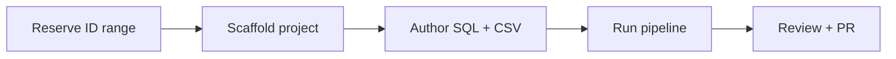

---
hide:
  - footer
title: Contributing Vocabularies
---

# Contributing Vocabularies

Teams with domain expertise can contribute vocabulary mappings directly through the **Custom Vocabulary Builder (CVB)** — an automated pipeline that turns mapping CSVs into OMOP-compatible vocabulary deltas.

## What is CVB?

The Custom Vocabulary Builder is a Docker-based pipeline that:

- Uses the [SSSOM](https://mapping-commons.github.io/sssom/) (Simple Standard for Sharing Ontological Mappings) format for mapping CSVs
- Validates mappings against the OMOP vocabulary
- Produces concept, concept_relationship, concept_ancestor, and source_to_concept_map deltas
- Packages releases for integration into the Enterprise OMOP build

EU2_Flowsheets is the reference implementation, with 57,000+ mapped source rows across clinical flowsheet data.

## Contribution Workflow

1. **Reserve an ID range** in the central registry to avoid collisions with other vocabulary projects
2. **Scaffold** a new vocabulary directory from the CVB template (`new-vocab.sh`)
3. **Author mappings** — write the source DDL, load script, and mapping CSV
4. **Run the pipeline** — Docker builds concept tables, validates mappings, and produces deltas
5. **Submit a PR** — the team reviews mapping quality and clinical accuracy before merge

## Key Mapping Columns

The mapping CSV uses SSSOM-based columns. The most important ones:

| Column | Description |
|--------|-------------|
| `subject_id` | Source concept ID (from your reserved range) |
| `subject_label` | Human-readable source term |
| `predicate_id` | Mapping relationship (e.g., `skos:exactMatch`) |
| `object_id` | Target OMOP concept ID |
| `mapping_justification` | Why this mapping is correct (e.g., `semapv:LexicalMatching`) |
| `author_id` | Who created the mapping |

??? note "Full column specification"
    The complete 21-column specification is documented in the CVB repository's `CONTRIBUTING.md`. Contact the team for repository access.

## Quality Validation

All mapping CSVs are validated by `validate-mapping-csv.py`, which checks:

- Required columns are present and non-empty
- Target concept IDs exist in the OMOP vocabulary
- Subject IDs fall within the project's reserved range
- No duplicate mappings
- Predicate and justification values use controlled vocabularies

CI enforces validation on every pull request — mappings that fail validation cannot be merged.

## Getting Access

!!! info "Repository access required"
    The CVB repository is hosted on GitHub under the Emory-OMOP organization. Contact the Enterprise OMOP team on the **OMOP Enterprise** Teams channel to request access and discuss your vocabulary contribution.

??? note "Prerequisites"
    - GitHub access to the Emory-OMOP organization
    - Docker installed locally
    - Familiarity with CSV editing and basic SQL
    - Domain expertise in the clinical area you're mapping
