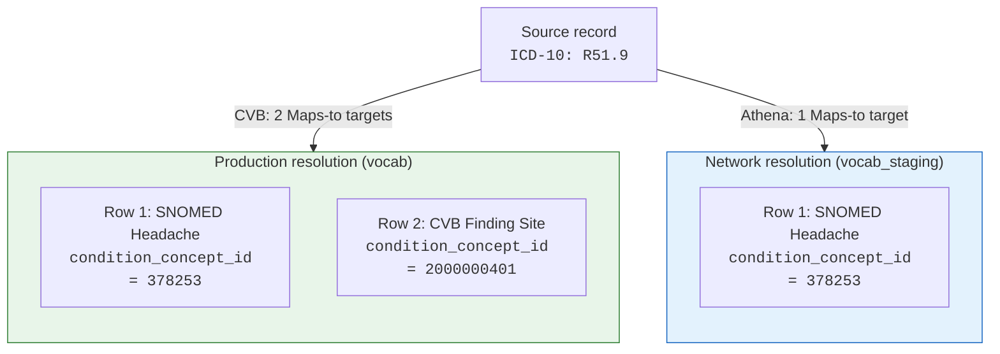
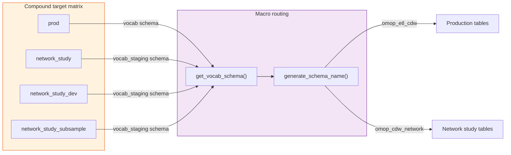
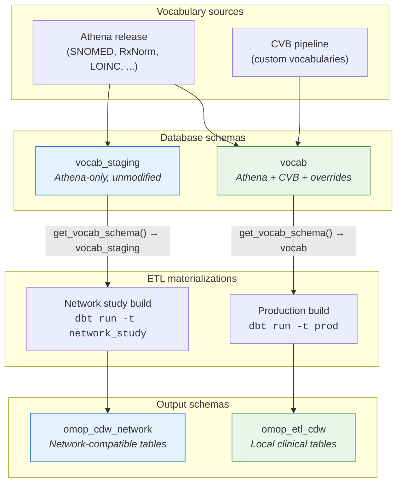

---
hide:
  - footer
title: Network Study Bifurcation
---

# Network Study Bifurcation

Custom concepts create a tension: Emory needs clinically meaningful local vocabulary extensions, but OHDSI network studies require every participating site to resolve concepts against identical vocabulary. This page documents the architectural decisions behind our approach to supporting both modes within the same ETL pipeline.

## Why CVB Diverges from OHDSI Guidelines

OHDSI convention states that custom concepts must be **non-standard** and should not appear in hierarchy tables like `concept_ancestor`. The Custom Vocabulary Builder (CVB) intentionally breaks this rule — it creates **Standard (S) custom concepts** and inserts them into `concept_ancestor`.

This divergence is deliberate. Without standard-status custom concepts, source codes that lack Athena coverage cannot resolve to clinically meaningful targets during ETL. The alternative — mapping everything to `concept_id = 0` — loses clinical specificity that Emory researchers depend on.

!!! warning "Intentional OHDSI divergence"
    CVB's promotion of custom concepts to Standard status is a **documented, traceable decision** — not an oversight. The `cvb_provenance` column (described below) makes every CVB modification auditable and reversible.

## The `cvb_provenance` Column

Every CVB-touched vocabulary table carries a `cvb_provenance TEXT` column across all 8 vocab tables: `concept`, `concept_relationship`, `concept_ancestor`, `concept_synonym`, `source_to_concept_map`, `vocabulary`, `mapping_metadata`, and `concept_relationship_metadata`.

| Value | Meaning |
|-------|---------|
| `NULL` | Row originates from Athena (unmodified) |
| `cvb:<VOCAB_ID>` | Row added by CVB for a specific vocabulary project |
| `override:<VOCAB_ID>` | Row overrides an existing Athena row (e.g., destandardization) |

This column enables filtering, auditing, and rollback at any granularity — from individual rows to entire vocabulary projects.

## Why Two Resolution Modes Are Necessary

OHDSI network studies (e.g., LEGEND, PheValuator benchmarks, EHDEN studies) require all participating sites to resolve source codes against **identical vocabulary** so that results are comparable across institutions. CVB modifications — custom concepts, hierarchy insertions, and destandardizations — break this comparability.

The pipeline therefore supports two resolution modes:

| Mode | Vocab schema | Contents | Use case |
|------|-------------|----------|----------|
| **Production (local)** | `vocab` | Athena + CVB overrides + custom vocabularies | Emory-internal research and clinical analytics |
| **Network study** | `vocab_staging` | Athena-only, unmodified | OHDSI multi-site studies requiring vocabulary parity |

## Why Dual Columns Were Rejected

The first design considered was adding dual concept columns to clinical tables — for example, `condition_concept_id` for local resolution and `condition_concept_id_network` for Athena-only resolution. Network study consumers would query through views that alias `_network` columns to standard OMOP column names.

**The advantage was clear**: avoid storing two full copies of billion-row clinical tables.

**The fatal flaw is row cardinality fan-out.**

### How OHDSI concept mapping creates rows

When a source code maps to multiple standard concepts via `concept_relationship` (`relationship_id = 'Maps to'`), the OMOP ETL convention is to create **one row per target concept** in the clinical table (Book of OHDSI §6.3). A single source record can produce N output rows depending on how many `Maps to` relationships exist.

### How CVB changes cardinality

CVB can alter the number of `Maps to` relationships for a given source code. For example:

- An ICD-10 code maps to **1 SNOMED concept** in Athena, but CVB maps it to **2 concepts** (a condition + a finding site)
- Or the reverse: CVB consolidates multiple Athena mappings into a single, more specific custom concept

When local resolution produces N rows and network resolution produces M rows (where M ≠ N), **dual columns on the same rows are impossible** — the row sets have different cardinalities.

/// caption
The same source record produces a different number of clinical table rows depending on which vocabulary is used for resolution. Dual columns cannot reconcile this difference.
///

## Why CVB Destandardization Complicates Schema Swaps

CVB doesn't only add new concepts — it can **destandardize existing Athena concepts** by changing `standard_concept` from `'S'` to `NULL`. This is used when a more specific custom concept should replace a broad Athena concept as the standard target.

After destandardization, the original standard status is **unrecoverable from the `vocab` schema alone**. The `vocab_staging` schema preserves the original Athena state and serves as the recovery path for network study resolution.

!!! note "Future improvement"
    An `athena_standard_concept` preservation column is planned but not yet implemented. Until then, `vocab_staging` is the authoritative source for original Athena concept status.

## The Chosen Approach: Compound Targets

Rather than trying to fit two resolution modes into a single materialization, we produce **two independent materializations** — same models, same SQL, but resolved against different vocabulary schemas, each with correct cardinality.

### How it works

dbt **compound targets** encode both the environment and the resolution mode in a single target name:

/// caption
Compound targets compose environment routing (dev, subsample, prod) with resolution mode (local vs network). The `get_vocab_schema()` macro checks whether `'network_study'` appears in the target name to select the correct vocabulary schema.
///

The key macros:

- **`get_vocab_schema()`** — returns `vocab` or `vocab_staging` based on whether `'network_study' in target.name`
- **`generate_schema_name()`** — routes output to the appropriate schema (e.g., `omop_etl_cdw` for production, `omop_cdw_network` for network study)

This approach composes cleanly with existing environment routing. Adding a network study variant of any environment is as simple as creating a new target with `network_study` in its name.

### Trade-offs

| | Dual columns | Compound targets |
|---|---|---|
| **Storage** | 1× clinical tables | 2× clinical tables |
| **Cardinality correctness** | Impossible when CVB changes mapping cardinality | Always correct — independent materializations |
| **Schema compatibility** | Requires views to alias columns | Native OMOP schema — no adapter layer |
| **Complexity** | Column-level logic in every model | Target-level routing in shared macros |
| **OHDSI tool compatibility** | Requires OHDSI tools to understand aliased views | Full compatibility — standard schema |

## Schema Architecture

/// caption
Athena loads into both `vocab_staging` (pristine) and `vocab` (where CVB applies modifications). Each ETL target reads from exactly one schema, producing independent output with correct cardinality.
///

## Summary of Decisions

| Decision | Choice | Rationale |
|----------|--------|-----------|
| Custom concept standard status | Standard (S) with hierarchy | Enables meaningful local concept resolution; mitigated by `cvb_provenance` traceability |
| Network study isolation | Separate `vocab_staging` schema | Preserves unmodified Athena state for cross-site comparability |
| Clinical table strategy | Compound targets with separate materializations | Dual columns impossible due to cardinality fan-out; compound targets give correct results with no adapter layer |
| Vocab schema routing | `'network_study' in target.name` macro convention | Composes with existing environment routing; zero model-level changes required |
| Destandardization recovery | `vocab_staging` as authoritative source | Original standard status unrecoverable from `vocab` after CVB destandardization |
