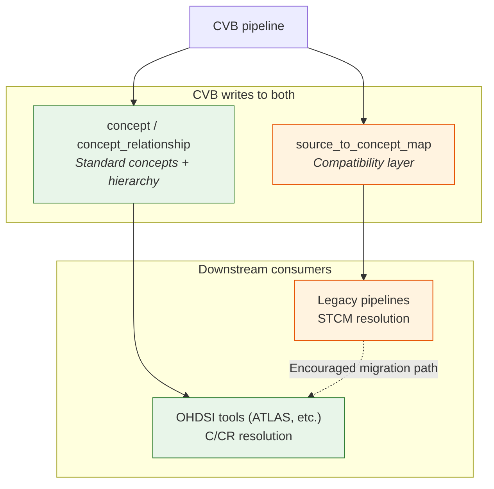

---
hide:
  - footer
title: Custom Vocabulary Strategy
---

# Custom Vocabulary Strategy

Emory's approach to custom vocabulary goes beyond the minimal OHDSI guidance for handling unmapped source codes. This page documents what we do, why each piece exists, and how the parts fit together.

## The Two Standard Approaches to Unmapped Source Codes

OHDSI provides two mechanisms for handling source codes that don't resolve to a standard concept in Athena:

### Source-to-Concept Map (STCM)

The `source_to_concept_map` table maps source codes directly to existing standard concepts. It's the lightest-weight option — no new concepts are created, and downstream tools don't need to know the mapping exists.

| Strength | Limitation |
|----------|-----------|
| Zero vocabulary modification | Only works when an appropriate standard concept already exists in Athena |
| Easy stakeholder adoption — familiar CSV-based workflow | Not visible to OHDSI tools that navigate `concept` and `concept_relationship` |
| Useful for local code system aliasing | Cannot express hierarchical relationships or multi-target mappings |

### 2-Billionaire Custom Concepts

OHDSI reserves concept IDs ≥ 2,000,000,000 for site-local ("2-billionaire") concepts. Institutions create new rows in the `concept` table with IDs in this range to represent data elements that have no Athena equivalent.

The standard OHDSI guidance for 2-billionaire concepts is conservative:

- Custom concepts should be **non-standard** (`standard_concept = NULL`)
- Custom concepts should **not** appear in `concept_ancestor`
- Custom concepts should be mapped **to** existing standard concepts via `concept_relationship`, not used as resolution targets themselves

## Why Emory Goes Further

We follow the 2-billionaire protocol for ID assignment but diverge from the conservative guidance on standard status and hierarchy participation. The reason is straightforward: **OHDSI tooling operates against the concept/concept_relationship model, not STCM.**

### OHDSI tools don't see STCM

ATLAS cohort definitions, CohortDiagnostics, CohortExplorer, PheValuator, and most OHDSI R packages build inclusion criteria from `concept` and `concept_relationship`. They navigate hierarchies through `concept_ancestor`. They do not query `source_to_concept_map`.

If a custom concept exists only as a non-standard entry in `concept` — mapped *to* a standard concept but never *as* a standard concept — it cannot be:

- Selected as a cohort entry event in ATLAS
- Found via descendant navigation in `concept_ancestor`
- Used as a target in phenotype definitions
- Resolved as a standard concept during ETL concept mapping

For Emory researchers using OHDSI tools locally, non-standard custom concepts are effectively invisible in the places that matter.

### What CVB does differently

The Custom Vocabulary Builder promotes 2-billionaire concepts to **Standard (S) status** and inserts them into `concept_ancestor` with appropriate parentage. This means:

- Custom concepts are **first-class citizens** in ATLAS and all OHDSI tooling
- Hierarchy navigation works — a custom flowsheet concept descends from the correct SNOMED parent
- Cohort definitions can include custom concepts directly
- ETL concept resolution can target custom concepts as standard endpoints

!!! warning "This is an intentional, traceable divergence"
    Promoting custom concepts to Standard status is not an OHDSI-endorsed pattern. We mitigate this through `cvb_provenance` traceability and [network study bifurcation](network-study-bifurcation.md) — custom concepts never leak into multi-site study outputs.

### CVB destandardization

CVB can also **destandardize existing Athena concepts** — changing `standard_concept` from `'S'` to `NULL` — when a more clinically specific custom concept should replace a broad Athena concept as the resolution target.

This is tracked via `cvb_provenance = 'override:<VOCAB_ID>'` and is recoverable through the `vocab_staging` schema, which preserves unmodified Athena state. See [Network Study Bifurcation](network-study-bifurcation.md) for how this interacts with multi-site studies.

## STCM as a Compatibility Layer

CVB populates `source_to_concept_map` **in addition to** the concept/concept_relationship model. This is not an alternative resolution path — it's a compatibility layer for downstream consumers whose pipelines resolve via STCM rather than C/CR.

Not every consumer has adopted the concept/concept_relationship resolution pattern. Some downstream ETL pipelines, research workflows, and legacy tooling resolve source codes by joining against `source_to_concept_map` directly. If we only wrote to C/CR, those consumers would get no resolution for CVB-mapped source codes — they'd be left out in the cold during their pipeline runs.

By populating both:

- **C/CR consumers** get full resolution with Standard concepts, hierarchy navigation, and OHDSI tool visibility
- **STCM consumers** get working resolution without needing to change their pipeline patterns
- **We encourage STCM consumers to adopt C/CR** over time, since OHDSI tooling (ATLAS, CohortDiagnostics, phenotype libraries) is built against the C/CR model and doesn't typically query STCM

The lift for populating STCM is low — CVB already knows the source-to-target mappings — so there's no reason not to serve both consumer patterns.

/// caption
CVB populates both C/CR and STCM. OHDSI tools consume C/CR; legacy pipelines consume STCM. Over time, consumers are encouraged to migrate to C/CR for full tooling compatibility.
///

## Vocabulary Metadata Tables

CVB writes to two metadata tables that are not part of the standard OMOP CDM v5.4 schema:

- **`mapping_metadata`** — provenance, authorship, and review status for individual concept mappings
- **`concept_relationship_metadata`** — audit trail for relationship modifications (additions, destandardizations)

These tables are used by the OHDSI Vocabulary Working Group internally but are not typically adopted by CDM implementers. We adopt them because:

1. **Traceability**: Every CVB modification has a documented author, review date, justification, and confidence score
2. **Auditability**: Regulatory and compliance workflows can trace any custom concept back to its origin
3. **Reversibility**: Metadata records enable targeted rollback of specific vocabulary changes without rebuilding from scratch

!!! note "CDM v5.5 and metadata tables"
    Parts of the vocabulary metadata model are expected to be adopted into CDM v5.5. Our early adoption means we will be positioned for that migration, but the timeline for v5.5 is uncertain and we are not waiting on it. The `cvb_provenance` column on core vocab tables provides immediate value independent of CDM version.

## How the Pieces Fit Together

| Component | Role | Who sees it |
|-----------|------|-------------|
| **STCM** | Compatibility layer for consumers resolving via `source_to_concept_map` | Legacy ETL pipelines |
| **2-billionaire concepts** | Standard concepts in `concept` + `concept_ancestor` (primary resolution path) | ETL, ATLAS, all OHDSI tools |
| **`cvb_provenance`** | Tracks origin of every vocab modification | Auditors, vocabulary team |
| **Metadata tables** | Full provenance for mappings and relationships | Vocabulary team, compliance |
| **`vocab_staging`** | Pristine Athena for network studies | Network study ETL builds |
| **Compound targets** | Separate materializations per resolution mode | dbt pipeline |

For details on how production and network study builds coexist, see [Network Study Bifurcation](network-study-bifurcation.md).

## Guidance for Stakeholders

**If your pipeline resolves via STCM** → CVB-mapped concepts are already available in `source_to_concept_map`. No changes needed. However, we encourage migrating to C/CR resolution over time — OHDSI tooling is built against that model.

**If you need new concepts for local research** → contribute a vocabulary through CVB using the [contributing vocabularies](contributing-vocabularies.md) workflow. Your concepts will be Standard, hierarchically placed, and fully integrated into the local OHDSI toolchain. CVB will populate both C/CR and STCM automatically.

**If you have unmapped source codes** → submit a [mapping request](requesting-mappings.md) and the vocabulary team will triage and build it into the next release.

**If you're running a network study** → your builds will use the `vocab_staging` schema automatically via compound targets. No action needed — CVB modifications are excluded by design.
