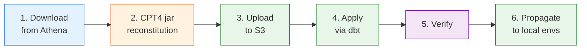

---
hide:
  - footer
title: OHDSI Vocabularies
---

# OHDSI Vocabularies

The OHDSI Standardized Vocabularies are the reference ontology for all data encoded in the OMOP Common Data Model. Emory maintains a local instance of these vocabularies, refreshed from [Athena](https://athena.ohdsi.org/) — the official OHDSI vocabulary distribution service — and loaded into our production environment via dbt.

This section documents how Emory sources, updates, and validates the official OHDSI vocabulary tables. For Emory-specific custom concepts built on top of these vocabularies, see [Custom Concepts](../Custom Concepts/index.md).

## Vocabulary Refresh Process

OHDSI publishes vocabulary updates through Athena. Each release contains additions, deprecations, and modifications across the full vocabulary corpus. Two distribution methods are available:

<div class="grid cards" markdown>

-   :material-database-import:{ .lg .middle } **Full Batch Download**

    ---

    Download the entire vocabulary corpus as CSV files. Truncate existing vocabulary tables and bulk load the new content.

    Best for: initial setup, major version jumps, or when the delta approach is impractical.

-   :material-delta:{ .lg .middle } **Incremental Delta Download**

    ---

    Generate a delta between any two vocabulary versions. Athena provides unified CSV files documenting additions, deletions, and modifications, plus a SQL script to apply the changes.

    Best for: routine updates between adjacent releases. Smaller download, reviewable changes, lower risk.

</div>

The incremental approach was developed by [Odysseus (EPAM) in collaboration with Memorial Sloan Kettering Cancer Center](https://www.epam.com/incremental-lifecycle-management-for-ohdsi-standardized-vocabularies) and is available directly in the Athena download interface.

### Delta Download Contents

When you generate a delta between two versions, Athena provides:

| Artifact | Purpose |
|----------|---------|
| **Delta CSVs** | Unified files per vocabulary table (CONCEPT, CONCEPT_RELATIONSHIP, CONCEPT_ANCESTOR, CONCEPT_SYNONYM, DOMAIN, VOCABULARY) showing additions, modifications, and deletions |
| **SQL script** | INSERT, UPDATE, and DELETE statements to apply the delta against existing vocabulary tables |

The delta CSVs serve double duty: they are the **impact assessment** (review what changed before applying) and the **change payload** (the data to load).

### Step-by-Step Refresh Process



#### 1. Download from Athena

Log in to [athena.ohdsi.org](https://athena.ohdsi.org/) and navigate to **Download**. Either re-select your existing vocabulary bundle or locate it in your download history.

**For a delta**: Select your current version as the source and the target release as the destination. Athena generates the delta for the vocabularies in your bundle. You will receive an email when the download is ready.

**For a full download**: Select all required vocabularies (see [Vocabulary Bundle](#vocabulary-bundle) below) and submit. You will receive an email with a download link.

#### 2. CPT4 Reconstitution

OHDSI does not have distribution rights for CPT-4 descriptions (AMA license). The download includes `cpt4.jar`, which pulls descriptions from the UMLS API and merges them into the vocabulary files.

```bash
java -Dumls-apikey=YOUR_UMLS_API_KEY -jar cpt4.jar 5
```

Get your UMLS API key from [uts.nlm.nih.gov](https://uts.nlm.nih.gov/uts/login). This step can take hours due to UMLS API rate limits. If it fails, restart — the process is idempotent.

!!! warning "Do not skip this step"
    Without CPT4 reconstitution, all CPT-4 concept names will be blank. This affects procedure mappings, billing code resolution, and any cohort definitions referencing CPT-4 concepts.

#### 3. Upload to S3

Upload the processed vocabulary files to the shared S3 location. Archive the previous version first so it can be restored if needed.

#### 4. Apply via dbt

**Full refresh**: Run the `EmoryOMOPVocabulariesIngest` dbt project, which reads from S3 external tables and loads into the vocabulary schema.

**Delta apply**: The SQL script from Athena contains INSERT, UPDATE, and DELETE statements. Since Athena (AWS) does not support UPDATE or DELETE natively, these must be translated to CTAS (Create Table As Select) patterns in dbt — merging delta rows against existing tables and materializing the result.

#### 5. Verify

After loading, confirm the refresh succeeded:

- **Version check**: Query `vocabulary_version` from the `vocabulary` table where `vocabulary_id = 'None'`
- **Row counts**: Compare concept counts by `vocabulary_id` against the prior version
- **Spot checks**: Verify specific concepts that were added, modified, or deprecated in the [OHDSI Forums release announcement](https://forums.ohdsi.org/c/vocabulary-users/11)

#### 6. Propagate to Local Environments

The production vocabulary in S3 feeds all downstream dbt projects (Enterprise, Winship, Nursing, Brain Health). Local development environments (DuckDB) require a separate refresh — see [Local DuckDB Refresh](#local-duckdb-refresh) below.

---

## Vocabulary Bundle

Emory's Athena bundle includes the vocabularies listed below. The **Athena ID** column matches the ID shown in the Athena download interface — use it to verify your selection matches this reference list.

The month-year columns (e.g., **Feb 25** = v20250227, **Feb 26** = v20260227) indicate whether the vocabulary was included in each Athena release bundle. :material-check: = included, :material-close: = not available in that release.

| Athena ID | Vocabulary | Category | Description | Feb 25 | Feb 26 |
|:---------:|------------|----------|-------------|:------:|:------:|
| 1 | SNOMED | Clinical | Systematic Nomenclature of Medicine – Clinical Terms (IHTSDO) | :material-check: | :material-check: |
| 2 | ICD9CM | ICD | ICD-9-CM Volumes 1 and 2 (NCHS) | :material-check: | :material-check: |
| 3 | ICD9Proc | ICD | ICD-9-CM Volume 3 (NCHS) | :material-check: | :material-check: |
| 4 | CPT4 | Clinical | Current Procedural Terminology version 4 (AMA) | :material-check: | :material-check: |
| 5 | HCPCS | Clinical | Healthcare Common Procedure Coding System (CMS) | :material-check: | :material-check: |
| 6 | LOINC | Clinical | Logical Observation Identifiers Names and Codes (Regenstrief Institute) | :material-check: | :material-check: |
| 8 | RxNorm | Clinical | RxNorm (NLM) | :material-check: | :material-check: |
| 9 | NDC | Clinical | National Drug Code (FDA and manufacturers) | :material-check: | :material-check: |
| 12 | Gender | OMOP-generated | OMOP Gender | :material-check: | :material-check: |
| 13 | Race | OMOP-generated | Race and Ethnicity Code Set (USBC) | :material-check: | :material-check: |
| 14 | CMS Place of Service | Admin | Place of Service Codes for Professional Claims (CMS) | :material-check: | :material-check: |
| 16 | Multum | Clinical | Cerner Multum (Cerner) | :material-check: | :material-check: |
| 21 | ATC | Clinical | WHO Anatomic Therapeutic Chemical Classification | :material-check: | :material-check: |
| 28 | VANDF | OMOP-generated | Veterans Health Administration National Drug File (VA) | :material-check: | :material-check: |
| 32 | VA Class | OMOP-generated | VA National Drug File Class (VA) | :material-check: | :material-check: |
| 35 | ICD10PCS | ICD | ICD-10 Procedure Coding System (CMS) | :material-check: | :material-check: |
| 40 | DRG | Admin | Diagnosis-related group (CMS) | :material-check: | :material-check: |
| 41 | MDC | Admin | Major Diagnostic Categories (CMS) | :material-check: | :material-check: |
| 43 | Revenue Code | Admin | UB04/CMS1450 Revenue Codes (CMS) | :material-check: | :material-check: |
| 44 | Ethnicity | OMOP-generated | OMOP Ethnicity | :material-check: | :material-check: |
| 47 | NUCC | Admin | National Uniform Claim Committee Health Care Provider Taxonomy Code Set | :material-check: | :material-check: |
| 48 | Medicare Specialty | Admin | Medicare provider/supplier specialty codes (CMS) | :material-check: | :material-check: |
| 50 | SPL | Clinical | Structured Product Labeling (FDA) | :material-check: | :material-check: |
| 60 | PCORNet | Research | National Patient-Centered Clinical Research Network (PCORI) | :material-check: | :material-check: |
| 65 | Currency | OMOP-generated | International Currency Symbol (ISO 4217) | :material-check: | :material-check: |
| 70 | ICD10CM | ICD | International Classification of Diseases, 10th Revision, Clinical Modification (NCHS) | :material-check: | :material-check: |
| 71 | ABMS | Admin | Provider Specialty (American Board of Medical Specialties) | :material-check: | :material-check: |
| 82 | RxNorm Extension | OMOP-generated | OMOP RxNorm Extension | :material-check: | :material-check: |
| 87 | Specimen Type | OMOP-generated | OMOP Specimen Type | :material-check: | :material-check: |
| 88 | CVX | Clinical | CDC Vaccine Administered CVX (NCIRD) | :material-check: | :material-check: |
| 89 | PPI | Research | AllOfUs_PPI (Columbia) | :material-check: | :material-check: |
| 90 | ICDO3 | Oncology | International Classification of Diseases for Oncology, Third Edition (WHO) | :material-check: | :material-check: |
| 109 | MEDRT | Clinical | Medication Reference Terminology MED-RT (VA) | :material-check: | :material-check: |
| 111 | Episode Type | OMOP-generated | OMOP Episode Type | :material-check: | :material-check: |
| 115 | Provider | OMOP-generated | OMOP Provider | :material-check: | :material-check: |
| 116 | Supplier | OMOP-generated | OMOP Supplier | :material-check: | :material-check: |
| 117 | HemOnc | Oncology | HemOnc Oncology Treatment Regimens & Drugs | :material-check: | :material-check: |
| 118 | NAACCR | Oncology | North American Association of Central Cancer Registries | :material-check: | :material-check: |
| 127 | Nebraska Lexicon | Research | Nebraska Lexicon (UNMC) | :material-check: | :material-check: |
| 128 | OMOP Extension | OMOP-generated | OMOP Extension (OHDSI) | :material-check: | :material-check: |
| 136 | ClinVar | Oncology | ClinVar (NCBI) | :material-check: | :material-check: |
| 138 | NCIt | Oncology | NCI Thesaurus (National Cancer Institute) | :material-check: | :material-check: |
| 141 | Cancer Modifier | OMOP-generated | Diagnostic Modifiers of Cancer (OMOP) | :material-check: | :material-check: |
| 145 | OncoKB | Oncology | Oncology Knowledge Base (MSK) | :material-check: | :material-check: |
| 146 | OMOP Genomic | OMOP-generated | OMOP Genomic vocabulary of known variants involved in disease | :material-check: | :material-check: |
| 147 | OncoTree | Oncology | OncoTree (MSK) | :material-check: | :material-check: |
| 148 | OMOP Invest Drug | OMOP-generated | OMOP Investigational Drugs | :material-check: | :material-check: |
| 156 | CDISC | Clinical | Clinical Data Interchange Standards Consortium (NCI) | :material-close: | :material-check: |
| 159 | HPO | Research | Human Phenotype Ontology | :material-close: | :material-check: |

---

## Local DuckDB Refresh

The OHDSI Agent and local development tools use a DuckDB instance with a copy of the vocabulary. After a production refresh, update the local copy:

```bash
# From emory_ohdsi_agent/
uv run python scripts/python/csv_to_parquet.py /path/to/vocab/files --vocab
VOCAB_DICT=$(uv run python scripts/python/get_filepaths.py /path/to/vocab/files)
uv run dbt run-operation load_data_duckdb \
  --args "{file_dict: $VOCAB_DICT, vocab_tables: true}" \
  --profiles-dir .
```

---

## Release Cadence

OHDSI publishes vocabulary releases on a roughly semi-annual schedule, with ad-hoc hotfixes as needed. Subscribe to Athena email notifications for your vocabulary bundle to be alerted when a new release is available. Release announcements are posted to the [OHDSI Forums Vocabulary Users category](https://forums.ohdsi.org/c/vocabulary-users/11).

---

## References

- [Athena Download Portal](https://athena.ohdsi.org/vocabulary/list)
- [EPAM: Incremental Lifecycle Management for OHDSI Vocabularies](https://www.epam.com/incremental-lifecycle-management-for-ohdsi-standardized-vocabularies)
- [Vocabulary-v5.0 Wiki: General Structure, Download and Use](https://github.com/OHDSI/Vocabulary-v5.0/wiki/General-Structure,-Download-and-Use)
- [Book of OHDSI Ch. 5: Standardized Vocabularies](https://ohdsi.github.io/TheBookOfOhdsi/StandardizedVocabularies.html)
- [OHDSI Forums: Share Your Vocab/Concept Updating Process](https://forums.ohdsi.org/t/share-your-vocab-concept-updating-process/13286)
- [Tantalus R Package (vocabulary version diffing)](https://github.com/OHDSI/Tantalus)
