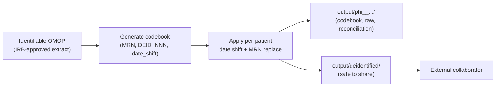

---
hide:
  - footer
title: Per-extract Sharing
---

# Per-extract de-identification

*Released in v1.0.0 — snapshot 2026-01-31*

When an individual research dataset leaves Emory for an external collaborator (a multi-institution lab consortium, an industry sponsor under DUA, a federated network like N3C), the OMOP team applies a **per-extract de-identification** workflow on top of (typically) an IRB-approved extract from identifiable OMOP. This is separate from — and complementary to — the [warehouse-level de-id](Warehouse%20Implementation.md).

## Why a separate workflow

Warehouse de-id is one-size-fits-all: the same Safe Harbor transformations run on every patient and every facility. That's appropriate for general analyst access, but it doesn't always serve specific research projects:

- A study sometimes needs **real time intervals** anchored to a specific event date (e.g., infusion date for a CAR-T cohort), which Safe Harbor's per-patient date shift preserves *within* a patient but breaks *across* patients.
- An external collaborator sometimes needs **a stable, project-specific surrogate identifier** (e.g., `DEID_001`, `DEID_002`) rather than a system-wide surrogate `person_id`.
- A study-specific codebook needs to be **physically separated** from the shared dataset so that re-identification capability stays inside Emory.

Per-extract de-id addresses these needs by applying a fresh layer of identifier replacement and date shifting at extract time, with the codebook held only in a PHI-restricted directory.

## The pattern

For each extract:

1. **Generate a per-extract codebook** mapping `(MRN, deid_id, date_shift_days)` triples — one row per patient.
    - `deid_id` is sequential: `DEID_001`, `DEID_002`, …
    - `date_shift_days` is a uniform random integer drawn from `[-180, -1] ∪ [+1, +180]` — zero excluded, per Safe Harbor.
    - A `--seed` argument is passed during generation so the codebook is reproducible.
2. **Apply the date shift consistently** across every date column for that patient — admission dates, discharge, lab dates, drug exposure, condition onset, etc. **Times of day are not shifted.**
3. **Replace MRN with `deid_id`** in the shared dataset.
4. **Stage outputs** into two physically separate directories:
    - `output/phi__emory_irb_approved_only/` — raw labs, the codebook, source-mapping artifacts, reconciliation reports. Stays inside the PHI-restricted SharePoint.
    - `output/deidentified/` — the date-shifted, MRN-replaced CSV (or other format) safe to share externally.
5. **Distribute** the de-identified subdirectory to the external collaborator.



## Reusable utility

The reference implementation is at `winship_omop_cowork_projects/deidentify.py` (Winship Cancer Institute cowork projects). Other groups within the OMOP team have adopted the same pattern.

Critical features of the implementation:

- `--seed` flag for reproducibility (regenerates the same codebook for the same input)
- Date-shift uniformly random over `[-180, -1] ∪ [+1, +180]` (`0` excluded to avoid the trivial-shift edge case)
- Per-patient shift consistently applied across **all** date columns
- Times of day preserved
- Codebook output in CSV format with explicit columns: `mrn,deid_id,date_shift_days`

## Distribution structure

For Winship lab requests as an example, the standard SharePoint layout is:

```
PROJECT__<id>__<name>/
└── output/
    ├── phi__emory_irb_approved_only/
    │   ├── <project>_labs_raw.csv          # real MRNs, real dates
    │   ├── <project>_codebook.csv          # mrn, deid_id, date_shift_days
    │   ├── <project>_loinc_mapping.csv     # if applicable
    │   ├── <project>_html_reports.html     # internal QC
    │   └── <project>_reconciliation.csv    # may contain masked MRNs
    └── deidentified/
        ├── <project>_labs.csv              # DEID_NNN, shifted dates
        ├── <project>_loinc_mapping.csv     # no PHI
        └── README.md                       # data dictionary
```

The `phi__emory_irb_approved_only` subdirectory is **never** distributed externally. Only the `deidentified` subdirectory crosses the trust boundary.

## When per-extract de-id is the right choice

| Scenario | Workflow |
|---|---|
| Multi-investigator analytics within Emory | Use the [warehouse de-id schema](Warehouse%20Implementation.md) directly |
| External collaborator under standard DUA | Per-extract de-id |
| Federated network with on-the-wire de-id | May not need per-extract — depends on network protocol |
| Public release of a research dataset | Per-extract de-id + Expert Determination review |
| Internal IRB-approved study (no external sharing) | Direct identifiable OMOP access |

## Best practices for analysts

1. **Generate the codebook once per extract.** Don't regenerate mid-project — the codebook is part of the project's audit trail.
2. **Document the seed** used for codebook generation in the project README. Reproducibility matters if the codebook is lost or needs to be regenerated.
3. **Validate that no real MRNs leaked into the de-id directory.** A simple regex check on the de-identified CSVs for any 7-digit (or other Emory MRN-shaped) values is a useful safety net.
4. **Reconciliation reports go in the PHI directory.** Even if MRNs are masked in the report, real MRNs may be inferable from row counts or cross-references.
5. **If the codebook is requested by an auditor**, share it from the PHI directory. Never share it alongside the de-id'd dataset.

---

[:octicons-arrow-left-24: De-identification](index.md)
