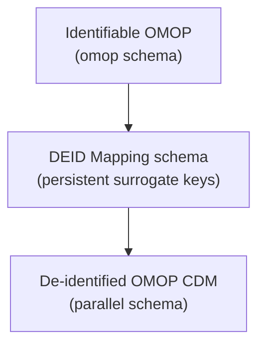

---
hide:
  - footer
title: Warehouse Implementation
---

# Warehouse de-identification — implementation surface

*Released in v1.0.0 — snapshot 2026-01-31*

The Emory OMOP team's warehouse-level de-identification builds a parallel OMOP CDM that meets HIPAA Safe Harbor requirements. Every clinical-fact and reference table is rebuilt with identifier surrogation, dates shifted per-patient, and the masking rules described below.

The pipeline lives in a single Redshift stored procedure: [`admin.sp_populate_omop_deid_tables`](https://github.com/EmoryDataSolutions/emory_omop_enterprise/blob/main/redshift_omop_stored_procedures/sp_populate_omop_deid_tables.sql) (~900 lines). It is parameterized by the target CDM schema (`cdmDatabaseSchema`) and a mapping schema where surrogate-key tables are persisted (`p_deid_map_schema`), so the same procedure can produce multiple de-identified schemas.

## Pipeline shape

The mapping schema persists across runs: the same real `person_id` always maps to the same surrogate `person_id`, the same `visit_occurrence_id` to the same surrogate, and so on. Stable surrogates make longitudinal queries on the de-id schema valid.

## Identifier surrogation

Seven mapping tables sit in `p_deid_map_schema`:

| Mapping table | Maps real ID → surrogate |
|---|---|
| `source_id_person` | Real `person_id` → surrogate `person_id` (plus per-patient `date_shift` and `over_89_birth_year`) |
| `source_id_visit` | `visit_occurrence_id` |
| `source_id_visit_detail` | `visit_detail_id` |
| `source_id_drug_exposure` | `drug_exposure_id` |
| `source_id_provider` | `provider_id` (plus `masked_provider_name`) |
| `source_id_location` | `location_id` |
| `source_id_care_site` | `care_site_id` |

Every clinical-fact insert joins back to the appropriate `source_id_*` table to swap real IDs for surrogates. The `omop` source is read-only — only the de-identified target schema is written.

## Care-site masking

Care sites with low encounter counts get masked because the combination of (rare facility) + (other quasi-identifiers) creates re-identification risk. The rule:

> For each care site, group by `care_site_name` (handling pipe-delimited patterns like `EUH 31 ICU|EUH 3107-04|3107-04` — group up to the second pipe). For each group, count visits per year. If more than 50% of years have <20 visits, mask `care_site_name`, `care_site_source_value`, and `place_of_service_source_value` as `'**Emory Masked**'`.

Implementation-relevant constants (from the SP):

- `VISIT_COUNT_THRESHOLD = 20` — minimum visits per year for a care site to be considered well-attended
- `PCT_SMALL_CNT_YRS_THRESHOLD = 0.5` — fraction of below-threshold years that triggers masking

Care sites that aren't referenced by any provider, visit_detail, or visit_occurrence are excluded from the de-id'd schema entirely (`caresite_included_list`).

## Location de-identification

Every row in `omop.location` is rebuilt into the de-identified schema with these transformations applied (see lines 226–291 of the SP):

**ZIP code:**

- Five-digit US ZIPs → first 3 digits (ZIP3 — Safe Harbor compliant)
- 18 specific ZIP3 codes mapped to `'000'`: `036`, `059`, `102`, `202`, `203`, `204`, `205`, `369`, `556`, `692`, `753`, `772`, `821`, `823`, `878`, `879`, `884`, `893` — the high-population-risk ZIP3s where 3-digit truncation alone is insufficient under Safe Harbor + US Census thresholds.
- Non-USA ZIPs (containing letters) → `'000'`
- All-zero ZIPs → `NULL`

**Address fields** (when the location's `location_mask_list` flag is `'masking needed'`):

- `address_1`, `address_2`, `city`, `county`, `location_source_value` → `'**Emory Masked**'`

**State:** preserved as 2-character code (Safe Harbor permits state granularity).

**Latitude / longitude:**

- Sentinel value `-99` (meaning "unknown" upstream) → preserved as-is
- Otherwise, when masked: `-88` (Emory's "intentionally masked" sentinel)
- Facility-level locations (care sites): preserved as-is, since facility addresses are publicly available and not patient-linked

The `-88` sentinel is an Emory convention to distinguish "deliberately masked for de-id" from `-99` ("unknown / not collected"). Treat both as missing in downstream analytics.

## Person de-identification

Every row in `omop.person` is rebuilt (lines 337–376 of the SP):

| Source field | De-identified transformation |
|---|---|
| `person_id` | Replaced with surrogate from `source_id_person` |
| `birth_datetime` | Per-patient random shift applied; **day always set to 1** (so date is reduced to year + month) |
| Year of birth | If patient is over 89 years old: set to the top-coded `over_89_birth_year`; else year of (shifted) DOB |
| `month_of_birth` | Month of (shifted) DOB |
| `day_of_birth` | Always `0` |
| `gender_concept_id`, `race_concept_id`, `ethnicity_concept_id` | Preserved (concept_ids are not PHI) |
| `gender_source_value`, `race_source_value`, `ethnicity_source_value` | Source-system prefix stripped (`SPLIT_PART(value, ':', 2)`) |
| `location_id`, `provider_id`, `care_site_id` | Replaced with surrogates |
| `person_source_value` | Set to empty string |

!!! tip "Per-patient date shift preserves intervals between events"
    The same `date_shift` value is applied to **every** date column for that patient (birth, visit, condition, drug exposure, etc.). This means *intervals between events* are preserved — time-to-event analyses (e.g., days from index condition to first drug exposure) work correctly in the de-id'd schema, even though absolute calendar dates are not real.

The `over_89_birth_year` value is held in the mapping table — it's a single high-age-bucket year used for all 89+ patients, in compliance with Safe Harbor's age top-coding requirement.

## Clinical-fact tables

The SP rebuilds every clinical-fact table with the same pattern: surrogate `person_id`, surrogate `visit_occurrence_id`, surrogate `provider_id`, all dates shifted by the patient's `date_shift`. Tables touched:

`visit_occurrence`, `visit_detail`, `condition_occurrence`, `procedure_occurrence`, `drug_exposure`, `observation`, `death`, `device_exposure`, `measurement`.

## Vocabulary passthrough

OHDSI vocabulary tables contain no PHI and are copied as-is into the de-id'd schema:

`concept`, `vocabulary`, `domain`, `concept_class`, `concept_relationship`, `relationship`, `concept_synonym`, `concept_ancestor`, `source_to_concept_map`, `drug_strength`.

## Restricted-access PII schema

In parallel to the de-id'd CDM, a restricted-access `OMOP_PII` schema (built by [`admin.sp_build_omop_pii_tables`](https://github.com/EmoryDataSolutions/emory_omop_enterprise/blob/main/redshift_omop_stored_procedures/sp_build_omop_pii_tables.sql)) holds fields that *would not* be in standard OMOP CDM and are needed for re-identification across sources:

- **`OMOP_PII.PATIENT`** — first / last / middle / maiden names, DOB, SSN, gender, ZIP, email, cell phone — both Epic and CDW values, cross-mapped on `person_id`. The `person_id` here is the **stable resolved person_id from emory_identity_gold**, not a deid surrogate. Direct queries against this table require IRB approval.
- **Mirror tables of `emory_identity_gold`** (`PERSON_ID_GOLD`, `PERSON_IDENTIFIER_GOLD`, etc.) — provided in the PII schema for re-identification workflows so investigators can rejoin de-id'd analytics back to identifiable patients without leaving the restricted environment.

See also [Emory Conventions — OMOP_PII.PATIENT](../../Observed%20Conventions/Emory%20Conventions/index.md#hidden-tables) for the full schema.

## Auditing and reproducibility

- The SP is **idempotent** when called with the same `cdmDatabaseSchema` and `p_deid_map_schema` — the mapping tables persist between runs, so surrogate keys are stable.
- The procedure logs each step with `RAISE INFO` so a runtime trace shows which masking decisions were made and how many rows were inserted at each step.
- A 12-validation-query QC suite (`jz_qc_explore.sql`) is the standard post-build check, exercising ZIP3 suppression, facility matching, and mask-status anomaly detection.

---

[:octicons-arrow-left-24: De-identification](index.md)
