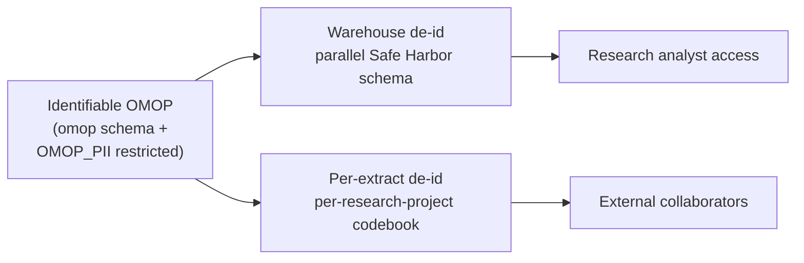

---
hide:
  - footer
title: De-identification
---

# De-identification

*Released in v1.0.0 — snapshot 2026-01-31*

!!! note "Scope"
    This page describes the de-identification practices used by the **Emory OMOP team** for the Enterprise OMOP warehouse. It is not a standard adopted across Emory Healthcare more broadly — other research and clinical-data programs at Emory operate independent de-id workflows. Published here for the OHDSI / informatics community.

??? abstract "Quick reference — what's on this page"

    [**Where this fits**](#where-this-fits) — the two-tier data model and two complementary de-id workflows.

    [**Safe Harbor compliance**](#safe-harbor-compliance) — how Emory addresses each of HIPAA's 18 identifiers (collapsible checklist).

    [**De-identification vs Limited Data Set**](#de-identification-vs-limited-data-set) — the HIPAA distinction and when each applies.

    [**Where to go next**](#where-to-go-next) — links to the warehouse-implementation deep dive and the per-extract sharing workflow.

    [**Best practices**](#best-practices) — for consumers and other OMOP teams.

    [**References**](#references) — HHS / HIPAA guidance.

## Where this fits

The Emory OMOP team operates two complementary de-identification workflows.

**Identifiable OMOP** lives in the standard `omop` schema, with a restricted-access `OMOP_PII` schema (see [Emory Conventions](../../Observed%20Conventions/Emory%20Conventions/index.md)) for fields that don't fit the CDM (cross-source name, DOB, SSN, contact info). Direct access requires IRB approval and is limited to credentialed investigators.

**Warehouse de-identification** ([Warehouse Implementation](Warehouse%20Implementation.md)) builds a parallel OMOP CDM that meets HIPAA Safe Harbor requirements: identifier surrogation, dates shifted per-patient, ages 89+ top-coded, ZIP3 truncation, care sites with low encounter counts masked. Most analysts query this schema.

**Per-extract de-identification** ([Per-extract Sharing](Per-extract%20Sharing.md)) is applied at sharing time when an individual research dataset leaves Emory for an external collaborator. It layers Safe Harbor-compliant date shifting and surrogate identifier replacement on top of (typically) an IRB-approved extract from identifiable OMOP, producing a sharable artifact paired with a codebook held only in PHI-restricted folders.

The two workflows are independent: an analyst working in the de-identified warehouse schema does not need to apply per-extract de-id (the data is already Safe Harbor compliant). An investigator working from identifiable OMOP for an external sharing project applies per-extract de-id at extract time.

## Safe Harbor compliance

Both workflows comply with HIPAA's [Safe Harbor method](https://www.hhs.gov/hipaa/for-professionals/privacy/special-topics/de-identification/index.html#safeharborguidance) of de-identification (45 CFR 164.514(b)(2)). Safe Harbor requires removing or masking 18 specific identifiers and a determination that no actual knowledge exists that the de-identified information could be re-identified.

??? example "How Emory addresses each of the 18 Safe Harbor identifiers"

    | # | Identifier | Emory's handling |
    |---|---|---|
    | 1 | Names | Removed; surrogate `person_id` only. PHI fields (`OMOP_PII.PATIENT.epic_pat_first_nm`, `cdw_pat_last_nm`, etc.) live in the restricted PII schema. |
    | 2 | Geographic subdivisions smaller than state | ZIP3 truncation; 18 high-population-risk ZIP3s mapped to `'000'`; non-USA ZIPs → `'000'`; address fields masked as `'**Emory Masked**'` for masked locations. |
    | 3 | All elements of dates (except year) | Per-patient random date shift applied across all date columns; day of birth always set to 0; ages 89+ top-coded. |
    | 4 | Telephone numbers | Excluded from de-identified schema. Lives in `OMOP_PII.PATIENT.epic_phone_cell` / `cdw_phone_cell` (restricted). |
    | 5 | Fax numbers | Not collected. |
    | 6 | Email addresses | Excluded. Lives in `OMOP_PII.PATIENT.epic_email_address` / `cdw_email_address` (restricted). |
    | 7 | Social security numbers | Excluded. Lives in `OMOP_PII.PATIENT.epic_ssn` / `cdw_ssn` (restricted). |
    | 8 | Medical record numbers | Replaced with deid surrogate `person_id`. Real MRNs (`pat_mrn_id`, `empi_nbr`, `clh_mrn`, `ejc_mrn`, `euh_mrn`, `sjh_mrn`, `tec_mrn`) live in `OMOP_PII.PATIENT` only. |
    | 9 | Health plan beneficiary numbers | Not represented in OMOP. |
    | 10 | Account numbers | Not represented in OMOP. |
    | 11 | Certificate / license numbers | Not represented in OMOP. |
    | 12 | Vehicle identifiers | Not represented in OMOP. |
    | 13 | Device identifiers and serial numbers | Generic device `concept_id`s only; serial numbers excluded. |
    | 14 | URLs | Not represented in OMOP. |
    | 15 | IP addresses | Not represented in OMOP. |
    | 16 | Biometric identifiers | Not represented in OMOP. |
    | 17 | Full-face photos | Not represented in OMOP. |
    | 18 | Other unique identifying numbers, characteristics, or codes | `_source_primary_key` columns retain non-identifying source-row keys for ETL provenance. Care site names with low encounter counts masked as `'**Emory Masked**'`. Latitude / longitude either retained at facility level or set to sentinel `-88` for masked person-linked locations. |

In addition to the 18-identifier list, Safe Harbor requires "no actual knowledge" that the de-identified information could be re-identified. This is a determination, not a checklist — Emory's data governance review is responsible for that assessment.

## De-identification vs Limited Data Set

HIPAA defines two distinct sharing tiers, and the distinction matters at extract time:

| | **De-identified (Safe Harbor)** | **Limited Data Set (LDS)** |
|---|---|---|
| Direct identifiers | Removed | Removed |
| Dates of service | Removed or shifted | **Retained** (real dates) |
| Geographic detail | ZIP3 only | **City, state, ZIP** retained |
| Ages 89+ | Top-coded | **Real DOB** retained |
| Regulatory designation | Not PHI; no DUA required | Still PHI; **DUA required** |
| Use cases | Public-facing analytics, broad sharing | Research with IRB approval where dates / fine geography are essential |

The warehouse de-id schema is **Safe Harbor**, not LDS. Researchers who require real dates (e.g., for time-to-event analyses anchored to a specific calendar date) or finer geography typically work directly from identifiable OMOP under IRB approval, then apply per-extract de-id at sharing time if they need to share results externally.

## Where to go next

-   :material-database-cog:{ .lg .middle } **Warehouse Implementation**

    ---

    Implementation surface of `sp_populate_omop_deid_tables`: identifier surrogation, care-site masking rules, ZIP3 truncation, lat/lon handling, person date-shift, age-89+ top-coding, clinical-fact tables, vocabulary passthrough.

    [:octicons-arrow-right-24: Warehouse Implementation](Warehouse%20Implementation.md)

-   :material-share-variant:{ .lg .middle } **Per-extract Sharing**

    ---

    The codebook + date-shift workflow applied at sharing time when individual research extracts leave Emory. PHI / de-id folder structure, MRN → DEID_NNN replacement, reproducibility seeds.

    [:octicons-arrow-right-24: Per-extract Sharing](Per-extract%20Sharing.md)

## Best practices

1. **Default to the de-identified warehouse for analytic work.** Direct access to identifiable OMOP requires IRB review; most analyses don't need it.
2. **Use the same surrogate `person_id` across queries.** The warehouse de-id maintains stable surrogates across runs (see [Warehouse Implementation](Warehouse%20Implementation.md)), so longitudinal queries on the de-id schema are valid.
3. **Don't attempt to combine de-id'd data with external identifiable sources.** Combining a Safe Harbor extract with another dataset on quasi-identifiers can break the de-identification determination.
4. **For external sharing, apply per-extract de-id even if the source is already de-identified.** Defense in depth: a per-project codebook adds a layer of separation between the de-id schema and the receiving party.
5. **Treat masked sentinel values as missing.** `'**Emory Masked**'`, ZIP3 = `'000'`, latitude / longitude = `-88` are sentinels indicating "intentionally masked" — they are not legitimate values for downstream computation.
6. **Document the de-id workflow used in any publication.** State whether your data was Safe Harbor or LDS and whether per-extract de-id was applied. Reviewers care.

## References

- US Department of Health and Human Services. **Guidance Regarding Methods for De-identification of Protected Health Information in Accordance with the HIPAA Privacy Rule**. <https://www.hhs.gov/hipaa/for-professionals/privacy/special-topics/de-identification/index.html>
- 45 CFR § 164.514(b)(2) — **Safe Harbor de-identification standard**
- 45 CFR § 164.514(e) — **Limited Data Set definition and DUA requirements**

---

[:octicons-arrow-left-24: Patient Identities](../index.md)
