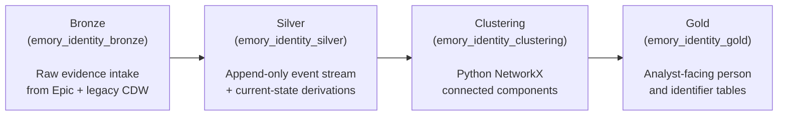

---
hide:
  - footer
title: Pipeline Overview
---

# Pipeline Overview

*Released in v1.0.0 — snapshot 2026-01-31*

The full Bronze → Silver → Clustering → Gold pipeline that builds Emory's canonical patient identity graph. Each layer owns a distinct concern and lives in its own database schema.

## The architecture

## What each layer does

**Bronze (`emory_identity_bronze`)** is the operational intake. It pulls raw identifier evidence from Epic Clarity (current and history tables — `identity_id`, `identity_id_hx`, PAT-level merge events) and from legacy CDW lookup tables in `clarity_onprem_omop`. Bronze maintains two rolling snapshots per source — *current* and *previous* — so that the next layer can compute deltas. Bronze itself is not a historical archive; the audit trail begins at Silver.

[:octicons-arrow-right-24: Bronze](Bronze/index.md)

**Silver (`emory_identity_silver`)** is the historical record. It builds an append-only event stream of every identifier change ever observed — attachments, detachments, merges, splits — and on top of that, materializes current-state tables (e.g., `identifier_attachment_current`) that say *which identifiers belong to which patient anchor right now*. Silver is the layer that owns the truth about how identities have evolved over time.

[:octicons-arrow-right-24: Silver](Silver/index.md)

**Clustering (`emory_identity_clustering`)** is where graph analysis happens. A Python job using [NetworkX](https://networkx.org/) reads Silver's edges (each edge meaning "these two identifiers belong to the same human"), runs connected-components analysis, and assigns a stable `person_id` to each component. Stability is enforced by survivorship rules — a `person_id` persists across re-runs whenever possible, so downstream consumers don't see IDs reshuffle. The output is written back to the warehouse as a set of `component → person_id` mapping tables.

[:octicons-arrow-right-24: Clustering](Clustering/index.md)

**Gold (`emory_identity_gold`)** is the analyst-facing surface. It turns the clustering output into a small set of denormalized, query-friendly tables: one row per `person_id`, the link table mapping every identifier node to its resolved person, current-state and historical identifier views, and merge-history records. If you're querying identity data, this is the layer you should read from — everything upstream is pipeline plumbing.

[:octicons-arrow-right-24: Gold](Gold/index.md)

## Pipeline ordering

The pipeline is staged so that each layer builds on a stable upstream:

1. **Bronze refresh** — pull the latest source snapshots, rotate `current` ↔ `previous`.
2. **Silver build** — compute deltas, append new identity events, refresh current-state derivations.
3. **Python clustering** — read Silver's edges, run NetworkX connected components, write `component → person_id` assignments.
4. **Gold build** — dbt rebuilds the analyst-facing tables from the freshly written clustering output.

The handoff in step 3 is the critical constraint: **Python clustering must complete before the gold layer can be built**, because the gold dbt models read directly from the clustering schema. In production this is orchestrated by Airflow, and `person_id`s are stabilized monthly.

## Where to go next

-   :material-database-import:{ .lg .middle } **Bronze**

    ---

    Source tables, the rolling current/previous pattern, and why bronze is operational rather than historical.

    [:octicons-arrow-right-24: Bronze](Bronze/index.md)

-   :material-graph:{ .lg .middle } **Silver**

    ---

    Identity events, edge types, and the current-state derivations that downstream layers depend on.

    [:octicons-arrow-right-24: Silver](Silver/index.md)

-   :material-graphql:{ .lg .middle } **Clustering**

    ---

    NetworkX connected components, survivorship rules, and `person_id` stability across re-runs.

    [:octicons-arrow-right-24: Clustering](Clustering/index.md)

-   :material-gold:{ .lg .middle } **Gold**

    ---

    The tables researchers query — plus query patterns for common identity lookups.

    [:octicons-arrow-right-24: Gold](Gold/index.md)

