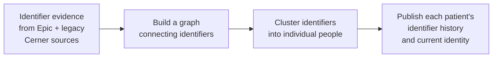

---
hide:
  - footer
title: Patient Identity Stabilization
---

# Patient Identity Stabilization

*Released in v1.0.0 — snapshot 2026-01-31*

## What this is, in plain English

Emory's clinical data spans Epic — the current EHR — and the legacy Cerner Clinical Data Warehouse, which captured patient encounters through 2022 and remains a historical reference. Patients accumulate identifiers across these systems and across Emory's hospitals: multiple MRNs, an Epic patient ID, sometimes registry IDs, and so on.

**Epic itself runs ongoing patient cleanup** — its identity team merges roughly several thousand duplicate patient records each month — but that cleanup is internal to Epic, doesn't reach back into legacy Cerner data, and isn't directly visible to researchers querying OMOP. Patient Identity Stabilization solves the broader problem: it ingests identifier evidence from every source, runs graph-based clustering to figure out which identifiers belong to the same human, and publishes a single canonical `person_id` so that all of a patient's clinical history shows up together — regardless of which identifier was attached to any given encounter.

## How it works, at a glance

Four conceptual steps:

1. **Collect identifier evidence** from current and historical source systems.
2. **Build a graph** where each identifier is a node and each piece of evidence ("these two identifiers belong together") is an edge.
3. **Cluster** the graph — each connected component represents one person.
4. **Publish** each patient's full identifier history alongside the current best understanding of which identifiers are theirs today.

## Where to go next

!!! tip "Analysts and researchers — start here"
    If you're pulling identity data for analysis, you almost always want the **Gold tables**. They are the analyst-facing surface; everything upstream is plumbing.

    [:octicons-arrow-right-24: Gold — tables you'll actually query](Gold/index.md)

For the deeper picture of how the pipeline is built:

-   :material-pipe-disconnected:{ .lg .middle } **Pipeline Overview**

    ---

    The full Bronze → Silver → Clustering → Gold pipeline, end to end, with the proper architecture diagram.

    [:octicons-arrow-right-24: Pipeline Overview](Pipeline%20Overview.md)

-   :material-database-import:{ .lg .middle } **Bronze**

    ---

    The ingestion layer — what source tables feed the graph and how raw evidence enters the pipeline.

    [:octicons-arrow-right-24: Bronze](Bronze/index.md)

-   :material-graph:{ .lg .middle } **Silver**

    ---

    The append-only event stream that captures every identifier change over time, plus the current-state derivations.

    [:octicons-arrow-right-24: Silver](Silver/index.md)

-   :material-graphql:{ .lg .middle } **Clustering**

    ---

    How Python (NetworkX) finds connected components in the identity graph and resolves each component to a single `person_id`.

    [:octicons-arrow-right-24: Clustering](Clustering/index.md)

-   :material-gold:{ .lg .middle } **Gold**

    ---

    The analyst-facing tables: `person_id_gold`, `person_identity_link_gold`, `person_identifier_gold` and friends — plus query patterns.

    [:octicons-arrow-right-24: Gold](Gold/index.md)

!!! tip "Related methodology"
    A separate write-up of Emory's [**Probabilistic Matching**](../Probabilistic%20Matching/index.md) work — Fellegi-Sunter match-weight derivation and priors — sits as a sibling page under Patient Identities. It documents the prior-derivation work that informs identity-evidence weighting and is published for reuse by other matching practitioners.
