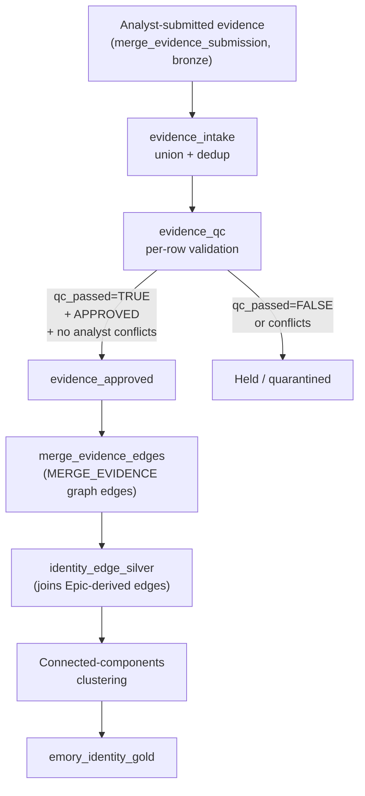

---
hide:
  - footer
title: Probabilistic Matching
---

# Probabilistic Matching

*Released in v1.0.0 — snapshot 2026-01-31*

!!! note "Scope"
    This page describes the methodology used by the **Emory OMOP team** for the Patient Identity Stabilization pipeline. It is not a standard adopted across Emory Healthcare more broadly — other identity-resolution efforts at Emory operate independently. The methodology is published here for the OHDSI / informatics community, where the math and decisions may be useful to teams running similar pipelines.

??? abstract "Quick reference — what's on this page"

    [**Where this fits**](#where-this-fits) — the OMOP team's hybrid approach: deterministic Epic-sourced graph + Fellegi-Sunter as an evidence gate.

    [**The Fellegi-Sunter model**](#the-fellegi-sunter-model) — match weights, posterior probability, intuition, empirical validation.

    [**Estimating m and u parameters**](#estimating-m-and-u-parameters) — three methods (confirmed pairs, EM, domain knowledge) and how to choose.

    [**Emory u-probabilities (population reference)**](#emory-u-probabilities-population-reference) — published u-values for identifiers and demographics, computed from the identity graph.

    [**Worked examples**](#worked-examples) — four worked computations from #347 (EMPI + demographics), manual chart review, encounter overlap, and a borderline names-only case.

    [**Evidence categories and thresholds**](#evidence-categories-and-thresholds) — `CLEAR_FIX` / `LIKELY_FIX` / `QUARANTINE_TYPE_*` and when to use each.

    [**How this connects to the OMOP pipeline**](#how-this-connects-to-the-omop-pipeline) — where evidence enters and where it becomes a graph edge.

    [**Best practices**](#best-practices) — eight rules of thumb for principled evidence submission.

    [**References**](#references) — the foundational and validation literature.

## Where this fits

The OMOP team's primary identity reconciliation mechanism is **graph-based connected components** on edges sourced directly from Epic Clarity. **Epic's identity tables are our source of truth**: when Epic merges two PATs (via `identity_id_hx`) or attaches an identifier to a PAT (via `identity_id`), we trust that. The deterministic clustering loop (see [Clustering](../Patient%20Identity%20Stabilization/Clustering/index.md)) does the heavy lifting on those edges.

But Epic doesn't always surface every legitimate merge. The #347 incident — 107,025 legacy `person_id` splits caused by an `EPIC::14` vs `EPIC::914` crosswalk bug — is the canonical example: those splits never appeared in `identity_id_hx`, so Epic never told us about them. We had to identify them ourselves through external evidence (demographic agreement + EMPI crosswalk).

For *additional* merge evidence the OMOP team produces internally — not what Epic surfaces — we take the submissions seriously. Every analyst-submitted merge claim is scored with **Fellegi-Sunter probabilistic record linkage** before it can become a graph edge. The math determines whether the evidence is strong enough to admit (`CLEAR_FIX` / `LIKELY_FIX`) or whether it should be held back for manual review (`QUARANTINE_TYPE_*`). This page documents that scoring framework.

The methodology generalizes beyond our hybrid use: practitioners doing fully-probabilistic matching as their primary mechanism can lift the m/u estimation guidance and Emory's published u-probabilities directly. Practitioners doing hybrid like us can lift the gate pattern.

## The Fellegi-Sunter model

### Why this framework

The evidence intake pipeline requires a numeric strength between 0 and 1 for every merge submission. Rather than assign arbitrary labels ("HIGH", "MEDIUM"), we use the **Fellegi-Sunter probabilistic record linkage model** (Fellegi & Sunter, 1969) to compute evidence strength from first principles.

This is not a niche choice. Fellegi-Sunter is:

- **The foundational theory** of probabilistic record linkage, published in the *Journal of the American Statistical Association* with thousands of citations.
- **The US Census Bureau's production methodology** for record linkage since the 1990 decennial census (via the BigMatch engine and its successors).
- **AHRQ's recommended approach** for healthcare record linkage, with a guideline of >95% sensitivity, PPV, and F-measure (Dusetzina et al., 2014).
- **Empirically validated** in hospital and public health settings with near-perfect accuracy (see the validation table below).

Tools like Splink, FastLink, and the Census Bureau's BigMatch are all *implementations* of this framework. The credibility comes from the math and decades of government and academic validation, not any single software package.

### How it works

Every comparison field provides **evidence** for or against a match. The evidence is quantified as a log-likelihood ratio (the "match weight"):

```
Match weight  W  =  Σ log₂(m_i / u_i)              [agreeing fields]
                  + Σ log₂((1 - m_i) / (1 - u_i))  [disagreeing fields]
```

Where for each field *i*:

- **`m_i`** = P(field agrees | the two records are a true match)
- **`u_i`** = P(field agrees | the two records are a random unrelated pair)

The ratio `m / u` is a **Bayes factor**: how much more likely is agreement under the match hypothesis than under the non-match hypothesis? In log space, evidence across fields adds.

The total match weight converts to a **posterior match probability**:

```
P(match) = 2^W / (1 + 2^W)
```

For large positive `W`, this simplifies to `P ≈ 1 - 2^(-W)`.

### Intuition

- A field with **high m and low u** (e.g., SSN: almost always agrees for true matches, almost never agrees by chance) provides **strong positive evidence** when it agrees.
- A field with **high m and high u** (e.g., gender: agrees for true matches *and* for random pairs ~50% of the time) provides **weak evidence** either way.
- **Disagreement on a high-m field** (e.g., DOB differs for what we believe is a true match) is mildly negative — true matches usually agree on DOB, but data-entry errors do happen, so it's not catastrophic.

### Empirical validation

| Study | Context | Sensitivity | Specificity | PPV |
|---|---|:---:|:---:|:---:|
| Grannis et al. (AMIA 2003) | Hospital registries, Indianapolis | 99.19% | 99.43% | — |
| Aldridge et al. (PLoS ONE 2015) | UK public health (EMS) | 99.5% | 100% | 99.8% |
| AHRQ (Dusetzina et al. 2014) | Healthcare linkage guidance | Recommends >95% for all three metrics | | |

The US Census Bureau has used Fellegi-Sunter–based methods for every decennial census since 1990 and for the American Community Survey.

## Estimating m and u parameters

The Fellegi-Sunter model needs two parameters per comparison field:

- **u** = P(field agrees | random unrelated pair) — a property of the population.
- **m** = P(field agrees | true match) — a property of your specific comparison context.

**u is shared; m is project-specific.** The Emory u-probabilities published in the next section can be used by any project working with Emory data. m, by contrast, must be estimated or justified for each evidence submission because it depends on your sources, time period, and comparison scenario.

### Estimating u

`u` is the coincidence rate: how likely are two random persons to share the same value for this field? Compute it as Simpson concentration (Newcombe et al., 1959; Fellegi & Sunter, 1969):

```
u = Σ (n_v / N)²
```

where `n_v` is the number of persons with value `v` and `N` is the total population. This is an *exact property* of the value distribution, not a statistical estimate.

For Emory data: population-level u-probabilities are published in the [next section](#emory-u-probabilities-population-reference), computed from the OMOP identity graph (script `09_compute_mu_parameters.sql`). Use them directly.

### Estimating m

`m` is the data-quality rate: how likely are two records *for the same person* to agree on this field? `m` varies by comparison context — cross-system pairs have lower `m` than within-system pairs because of independent data entry, temporal gaps, and name changes between sources.

There are three established approaches:

=== "Method 1: From confirmed pairs"

    If you have pairs confirmed to be the same person by an authoritative source (shared EMPI, manual chart review, deterministic linkage on a highly reliable field):

    ```
    m = (pairs where field agrees) / (pairs where both sides have non-null values)
    ```

    This directly measures agreement in your specific context. It's the most transparent approach — reviewers can inspect the pairs and verify the computation (Winkler, 1988; AHRQ Ch. 4).

    **When to use**: you have an authoritative identifier or gold-standard labels connecting pairs across your comparison sources.

    **Limitations**: `m` is specific to the population and context of your confirmed pairs. Pairs identified by one mechanism may not represent all same-person pairs. Always document selection criteria and acknowledge scope.

=== "Method 2: EM algorithm"

    The Expectation-Maximization algorithm treats match status as a latent variable and iteratively estimates `m` and `u` from unlabeled comparison pairs. This is the Census Bureau's production approach since the 1990 decennial census (Winkler, 1988; Jaro, 1989).

    Implementations: **Splink** (Python), **FastLink** (R), Census Bureau **BigMatch**.

    **When to use**: large datasets with no labeled pairs and enough separation between match and non-match distributions for the algorithm to converge.

    **Limitations**: can converge to local optima. Requires careful initialization and convergence diagnostics. Validate against any available ground truth (Larsen & Rubin, 2001).

=== "Method 3: Domain knowledge"

    Justify `m` from understanding of your data sources without explicit computation:

    - "Both sides pull from the same registration system → m ≈ 0.99"
    - "Independent data entry across systems with temporal gaps → m ≈ 0.93–0.95"
    - "Field is self-reported and changes over time (e.g., address) → m ≈ 0.70"

    **When to use**: exploratory work, small-scale evidence, or when Methods 1 / 2 are impractical. Must be documented with explicit reasoning.

    **Limitations**: subjective. Should be replaced with empirical estimates when data becomes available.

### Choosing a method

| Scenario | Recommended | Rationale |
|---|---|---|
| You have confirmed pairs from an authoritative identifier | Method 1 | Direct measurement; most transparent |
| Large dataset, no labeled pairs | Method 2 (EM) | Scalable; well-validated at Census Bureau |
| Exploratory or small-scale | Method 3 | Practical; document assumptions carefully |
| Cross-system comparison | Method 1 preferred | Cross-system `m` differs substantially from within-system; measure directly |

!!! tip "Conservative default — when uncertain, lower m"
    Lower `m` produces lower match weights, which reduces false merges at the cost of some missed true merges. For patient identity, false merges (combining two different patients) are far more harmful than missed merges (keeping duplicates).

The OMOP team's evidence pipeline requires documented `m` justification with each submission. Cite the method, the data source, and any known limitations.

## Emory u-probabilities (population reference)

`u` = P(two random persons share the same value). This is a property of the Emory patient population, not of any particular investigation. Computed as Simpson concentration: `u = Σ (n_v/N)²`.

These values are stable across projects working with Emory OMOP data. Use them directly.

**Agree weight** = `log₂(m / u)`. **Disagree weight** = `log₂((1 - m) / (1 - u))`.

### Identifiers

Computed from the OMOP identity graph (script `09_compute_mu_parameters.sql`, Part B). All 55 identifier types in the graph have `u_empirical = u_uniform` — every identifier value maps to exactly one `person_id` within its type, so `u` reduces to `1 / N_distinct`.

| Identifier | u | Max agree wt | Population |
|---|:---:|:---:|---|
| EMPI (`EPIC::914` / `CDW::EMPI`) | 1.46e-7 | +22.7 | 6.85M persons |
| Any type-verified identifier | 1 / N | +log₂(N) | N = distinct values for the type |

!!! warning "Type-uncertainty caveat"
    35% of identifier values exist under 2+ id_types in the Emory graph (script 09, Part C). When identifier *type* is unverified (e.g., a numeric value that could be `CDW::EMPI` *or* `EPIC::14`), the effective `u` is dominated by cross-type overlap, not within-type collision. Always verify identifier type from source before using these u-values.

### Demographics

Computed from the Epic (~6.6M persons) and CDW (~6.8M persons) populations (script 09, Part E).

| Field | u (Epic) | u (CDW) | Max agree wt |
|---|:---:|:---:|:---:|
| Last name (exact, uppercased) | 0.00101 | 0.00101 | +10.0 |
| First name (exact, uppercased) | 0.00144 | 0.00168 | +9.4 / +9.2 |
| DOB (exact date) | 3.04e-5 | 5.12e-5 | +15.0 / +14.3 |

### What about m?

`m` = P(field agrees | true match) is project-specific and must be estimated for each evidence submission. See [Estimating m and u parameters](#estimating-m-and-u-parameters) for the three methods and guidance on choosing one.

We deliberately do **not** publish a generic `m` reference table for Emory data: an `m` computed from one investigation's confirmed pairs (e.g., #347's 107K cross-system EMPI matches) would not be representative of all same-person comparison contexts, and publishing it as a general-purpose value would be intellectually misleading.

## Worked examples

??? example "Example A — EMPI crosswalk + demographics (Issue #347)"

    This is the case for the 107,025 legacy splits identified in #347. Every pair has an EMPI crosswalk match (precondition), plus we compare last name, first name, and DOB.

    `m`-probabilities were estimated from this investigation's confirmed pairs (script `09_compute_mu_parameters.sql`, Part F): last name `m=0.940`, first name `m=0.964`, DOB `m=0.993`. `u`-probabilities are taken from the population reference above.

    **CLEAR_FIX pair** (all fields agree):

    ```
    EMPI crosswalk:  +22.7  (precondition; u=1.46e-7)
    Last name:        +9.9  (agree; m=0.940, u=0.00101)
    First name:       +9.3  (agree; m=0.964, u=0.00156)
    DOB:             +14.6  (agree; m=0.993, u=4.08e-5)
                     -----
    Total W:         +56.5

    P(match) = 1 - 2^(-56.5) > 0.9999999999999
    Capped:   0.99
    ```

    **LIKELY_FIX pair** (DOB agrees, names differ):

    ```
    EMPI crosswalk:  +22.7  (precondition)
    Last name:        -4.1  (disagree)
    First name:       -4.8  (disagree)
    DOB:             +14.6  (agree)
                     -----
    Total W:         +28.4

    P(match) = 1 - 2^(-28.4) > 0.9999999
    Capped:   0.99
    ```

    Even with both names disagreeing, the EMPI crosswalk + DOB combination is overwhelming. A shared authoritative identifier plus DOB agreement is near-certain evidence.

??? example "Example B — manual chart review (single strong field)"

    An analyst manually reviews charts and determines two `person_id`s are the same patient.

    ```
    Manual chart review:  +10.0  (agree)
                          -----
    Total W:              +10.0

    P(match) = 1 - 2^(-10.0) = 0.999
    Capped:   0.99
    ```

    A single strong field can be sufficient if its `m / u` ratio is high enough.

??? example "Example C — encounter overlap + DOB, no shared identifier"

    Two `person_id`s have overlapping encounter dates at the same facility and matching DOB, but no shared identifier. Suppose you estimate encounter overlap at `m = 0.30`, `u = 0.001`.

    ```
    Encounter overlap:  +8.2   (agree; log₂(0.30 / 0.001))
    DOB (exact):        +14.6  (agree; u=4.08e-5 from reference)
                        -----
    Total W:            +22.8

    P(match) = 1 - 2^(-22.8) > 0.9999999
    Capped:   0.99
    ```

    Even without an authoritative identifier, strong circumstantial evidence can accumulate. However, this requires careful validation of the encounter-overlap `m / u` estimates.

??? example "Example D — borderline (names only, no DOB or identifier)"

    Two `person_id`s share last name and first name but have no DOB or identifier match.

    ```
    Last name:   +9.9   (agree; m illustrative, u=0.00101 from reference)
    First name:  +9.3   (agree; m illustrative, u=0.00156 from reference)
                 -----
    Total W:    +19.2

    P(match) = 1 - 2^(-19.2) > 0.9999
    Capped:   0.99
    ```

    This *looks* strong, but be cautious: common name combinations (e.g., "JOHN SMITH") have substantially higher `u` values than the population average. For a common name pair, `u` for last name might be 0.02 and `u` for first name might be 0.03 — recalculating with the same `m`:

    ```
    Last name:   +5.6   (log₂(0.940 / 0.02))
    First name:  +5.0   (log₂(0.964 / 0.03))
                 -----
    Total W:    +10.6

    P(match) = 0.9994
    ```

    Still high — but without an identifier or DOB, this should be flagged as `LIKELY_FIX` at best, not `CLEAR_FIX`. **Always include at least one authoritative or highly discriminating field for `CLEAR_FIX` classification.**

## Evidence categories and thresholds

The OMOP team's pipeline classifies submitted evidence into four buckets based on the match weight and which fields agree.

| Category | Criteria | Typical evidence | Action |
|---|---|---|---|
| **`CLEAR_FIX`** | Authoritative identifier match + full demographic agreement (last name, first name, DOB) | W > 30, P = 0.99 | Auto-approved as a `MERGE_EVIDENCE` graph edge |
| **`LIKELY_FIX`** | Authoritative identifier match + partial demographic agreement (at least DOB) | W > 15, P = 0.99 | Auto-approved as a `MERGE_EVIDENCE` graph edge |
| **`QUARANTINE_TYPE_2`** | Identifier match but DOB disagrees (name agrees) | Mixed weights | Held for manual review |
| **`QUARANTINE_TYPE_1`** | Identifier match but both name and DOB disagree | Low or negative total W | Held for manual review |

### Decision rules

- **`CLEAR_FIX`** / **`LIKELY_FIX`** — submitted with `evidence_strength` from the Fellegi-Sunter posterior. Pipeline auto-admits as a graph edge.
- **`QUARANTINE_TYPE_1`** / **`QUARANTINE_TYPE_2`** — *not* submitted as merge evidence. Flagged for manual chart review. If review confirms the match, the pair is resubmitted as `CLEAR_FIX` with the reviewer recorded as the submitter and `evidence_strength` from the manual-review weight (+10.0 → P = 0.999, capped at 0.99).

## How this connects to the OMOP pipeline



The Fellegi-Sunter scoring sits in front of the entire flow: an analyst computes the match weight, picks a category (`CLEAR_FIX` / `LIKELY_FIX` / `QUARANTINE_*`), and submits to the bronze table. The pipeline's job from there is QC and conflict detection — but the math that determined whether a pair was strong enough to submit as `CLEAR_FIX` vs `LIKELY_FIX` lives in this page.

The match weight itself is preserved as metadata in the `match_weight` column threaded through every stage, even though the deterministic clustering algorithm at the end doesn't *use* the weight (every admitted edge is treated equally). The metadata exists so a future reviewer can trace why a pair was admitted.

The actual SQL for `m`/`u` computation, the empirical Emory values, and the #347 evidence-generation queries live in [`qa/issues/347/`](https://github.com/EmoryDataSolutions/emory_omop_enterprise/tree/main/qa/issues/347) on the engineering side.

## Best practices

1. **Generalize from samples.** If you find a pattern in a small set, sweep the full identity graph for the same pattern before submitting evidence. The original analyst sample for #347 was 3,968 rows; the underlying issue affected 107,025.
2. **Use Fellegi-Sunter for scoring.** Compute `evidence_strength` from the model rather than assigning arbitrary values. Document your `m` / `u` parameter choices.
3. **Document your m/u choices.** If you use the published Emory u-values, cite them. If you deviate, explain why. Future reviewers need to understand the basis for your scores.
4. **Include at least one authoritative field for `CLEAR_FIX`.** Names and DOB alone can be coincidental, especially for common names. An EMPI crosswalk, SSN, or chart review provides the discriminating evidence.
5. **Use conservative quarantine.** When in doubt, quarantine. The cost of a false merge (combining two real patients) is much higher than the cost of a missed merge (keeping a duplicate). `QUARANTINE_TYPE_1` and `QUARANTINE_TYPE_2` exist specifically for pairs with identifier agreement but demographic disagreement.
6. **Check for cascading effects.** Merging person A with person B may transitively connect person B's existing component with person A's. Review the connected-components output for unexpectedly large clusters after merging.
7. **Submit in batches with consistent evidence-id prefixes.** Makes it easy to trace, audit, and roll back a batch of evidence if needed.
8. **Set status = APPROVED only after review.** If you're submitting evidence that hasn't been reviewed by a second person, use `status = PENDING` and have an admin review before the pipeline processes it.

## References

References were verified against Semantic Scholar and Dimensions.ai (citation databases) on 2026-05-06. Each entry includes a DOI where one exists; PubMed ID where no DOI is assigned; gray-literature items (US Census Bureau Statistical Research Division reports, AHRQ government reports) are cited by their authoritative publication identifier.

- Newcombe HB, Kennedy JM, Axford SJ, James AP. Automatic Linkage of Vital Records. *Science*. 1959;130(3381):954-959. doi:[10.1126/science.130.3381.954](https://doi.org/10.1126/science.130.3381.954)
- Fellegi IP, Sunter AB. A Theory for Record Linkage. *Journal of the American Statistical Association*. 1969;64(328):1183-1210. doi:[10.1080/01621459.1969.10501049](https://doi.org/10.1080/01621459.1969.10501049)
- Winkler WE. Using the EM Algorithm for Weight Computation in the Fellegi-Sunter Model of Record Linkage. *US Census Bureau Statistical Research Division*. 1988. *(No DOI; gray literature.)*
- Jaro MA. Advances in Record-Linkage Methodology as Applied to Matching the 1985 Census of Tampa, Florida. *Journal of the American Statistical Association*. 1989;84(406):414-420. doi:[10.1080/01621459.1989.10478785](https://doi.org/10.1080/01621459.1989.10478785)
- Winkler WE. Improved Decision Rules in the Fellegi-Sunter Model of Record Linkage. *US Census Bureau Statistical Research Division Report* RR93-12. 1993. *(No DOI; gray literature.)*
- Larsen MD, Rubin DB. Iterative Automated Record Linkage Using Mixture Models. *Journal of the American Statistical Association*. 2001;96(453):32-41. doi:[10.1198/016214501750332956](https://doi.org/10.1198/016214501750332956)
- Grannis SJ, Overhage JM, Hui S, McDonald CJ. Analysis of a probabilistic record linkage technique without human review. *AMIA Annual Symposium Proceedings*. 2003:259-263. PMID: [14728174](https://pubmed.ncbi.nlm.nih.gov/14728174/) *(No DOI assigned.)*
- Dusetzina SB, Tyree S, Meyer AM, et al. Linking Data for Health Services Research: A Framework and Instructional Guide. *AHRQ Publication No. 14-EHC033-EF*. 2014. *(No DOI; AHRQ government report.)*
- Aldridge RW, Shaji K, Hayward AC, Abubakar I. Accuracy of Probabilistic Linkage Using the Enhanced Matching System for Public Health and Epidemiological Studies. *PLoS ONE*. 2015;10(8):e0136179. doi:[10.1371/journal.pone.0136179](https://doi.org/10.1371/journal.pone.0136179)

---

[:octicons-arrow-left-24: Patient Identities](../index.md)
