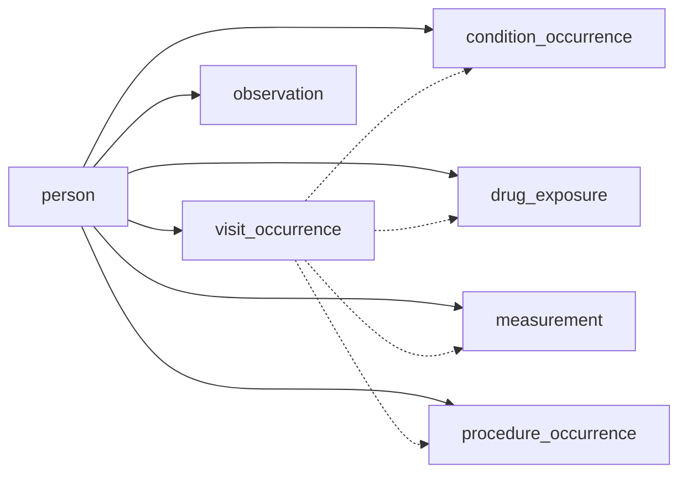

---
hide:
  - footer
title: OMOP Primers
---

# OMOP Primers — The Epic-to-OMOP Bridge

You know Epic. You've queried Clarity, built reports from Caboodle, or pulled data from the CDW. OMOP organizes the same clinical data differently — and once you see the mapping, it clicks fast.

!!! info "How to use these primers"
    Each primer page maps familiar EHR concepts (Clarity tables, encounter types, order entries) to their OMOP equivalents. Start with [When to Use OMOP](When%20to%20Use%20OMOP/index.md) if you're deciding whether OMOP fits your project, or jump straight to a table below.

## The Key Shift: Encounters vs. Patients

In Epic, most data is organized around **encounters** — an office visit, an ED arrival, an admission. You navigate from the encounter to the patient's orders, results, and diagnoses.

In OMOP, data is organized around **patients**. The `person` table is the center of the universe. Visits, conditions, drugs, measurements, and procedures all link back to `person_id`. Encounters still exist (`visit_occurrence`), but they're one of many tables hanging off the patient — not the organizing spine.

## Quick Orientation

| If you're used to this in Epic... | ...look here in OMOP |
|---|---|
| Patient demographics (MRN, DOB, sex, race) | `person` |
| Encounters / ADT | `visit_occurrence` + `visit_detail` |
| Encounter diagnoses, problem list | `condition_occurrence` |
| Medication orders, MAR | `drug_exposure` |
| Lab results, flowsheet vitals | `measurement` |
| Procedures, surgical cases, imaging orders | `procedure_occurrence` |
| Clinical notes, discharge summaries | `note` + `note_nlp` |
| Questionnaires, social history, smoking status | `observation` |
| ICD-10, CPT, SNOMED, RxNorm, LOINC codes | Standardized Vocabularies |

## Explore by Category

-   :material-heart-pulse:{ .lg .middle } **Clinical Data**

    ---

    The core patient-level tables: conditions, drugs, measurements, procedures, visits, observations, notes, devices, specimens, and more.

    [:octicons-arrow-right-24: Clinical Data tables](Standardized%20Categories/Clinical%20Data/index.md){ .md-button }

-   :material-hospital-building:{ .lg .middle } **Health System**

    ---

    Where care happens and who provides it: locations, care sites, and providers.

    [:octicons-arrow-right-24: Health System tables](Standardized%20Categories/Health%20System/index.md){ .md-button }

-   :material-book-open-variant:{ .lg .middle } **Vocabularies**

    ---

    The mapping layer that makes OMOP work — how ICD, CPT, NDC, and local codes translate to standard concepts.

    [:octicons-arrow-right-24: Vocabulary primer](Standardized%20Categories/Vocabularies/index.md){ .md-button }

-   :material-cash-multiple:{ .lg .middle } **Health Economics**

    ---

    Cost and payer plan data. Sparse in EHR-derived OMOP (including Emory) but important for claims-linked studies.

    [:octicons-arrow-right-24: Health Economics tables](Standardized%20Categories/Health%20Economics/index.md){ .md-button }

-   :material-help-circle-outline:{ .lg .middle } **When to Use OMOP**

    ---

    Decision guide: when OMOP is the right choice over Clarity, Caboodle, or the Reporting Workbench — and when it isn't.

    [:octicons-arrow-right-24: Decision guide](When%20to%20Use%20OMOP/index.md){ .md-button }

!!! tip "New to OMOP entirely?"
    Start with our [Training](../Training/index.md) page — the Basic Pathway takes about an hour and covers the CDM fundamentals. Then come back here to see how it maps to what you already know from Epic.

## The CDM at a Glance

The diagram below shows all OMOP CDM v5.4 tables, color-coded by category. Our primers cover the tables most relevant to Emory researchers.

