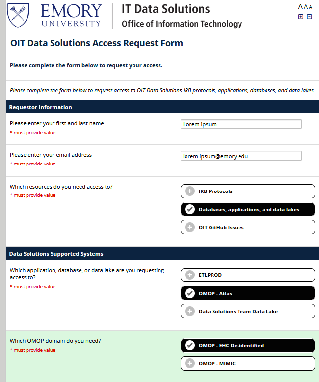
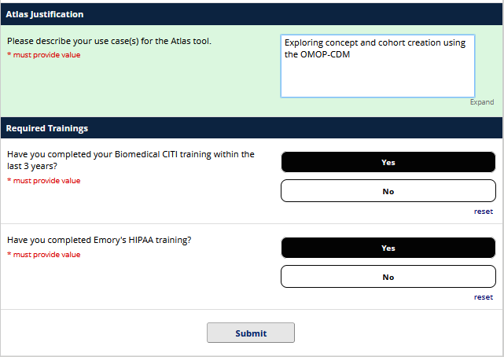
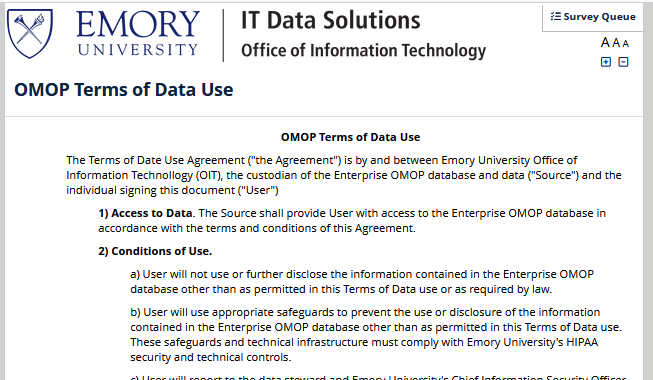

---
search:
  exclude: false
title: Request Database Access
---

# Request Database Access

Get direct SQL access to Emory's OMOP data lake on Amazon Redshift — query with your own tools, your own code, on your own terms.

## What You'll Get

<div class="grid cards" markdown>

-   :material-database-search:{ .lg .middle } __Full SQL Access__

    ---

    Query all OMOP Common Data Model tables directly — conditions, drugs, measurements, procedures, visits, and more.

-   :material-tools:{ .lg .middle } __Use Any Tool__

    ---

    Connect from DBeaver, Python, R, the AWS Console query editor, or any Redshift-compatible client.

-   :material-table-arrow-down:{ .lg .middle } __Export Your Results__

    ---

    Pull result sets into your local environment for downstream analysis, visualization, or modeling.

-   :material-swap-horizontal:{ .lg .middle } __Beyond ATLAS__

    ---

    Access tables, columns, and query patterns that ATLAS doesn't expose. Full flexibility for custom research.

</div>

!!! info "How is this different from ATLAS?"
    ATLAS is a point-and-click web application for cohort building and standardized analyses. Database access gives you the underlying tables with full SQL flexibility. Many researchers use both — ATLAS for exploration, SQL for custom queries.

## Prerequisites

Before submitting your request, confirm the following:

- [x] **Emory VPN** — connected and working[^1]
- [x] **Biomedical CITI training** — completed within the last 3 years
- [x] **Emory HIPAA training** — completed

[^1]: You can verify your VPN by accessing any internal Emory resource. If you need VPN help, contact [Emory IT](https://it.emory.edu){ target="_blank" }.

## Request Access

All access requests go through a single REDCap form — the same one used for ATLAS. The key difference is which system you select in Step 1.

[:octicons-arrow-right-24: Open the Access Request Form](https://redcap.emory.edu/surveys/?s=KTPWCCDPEHFYLETP){ target="_blank" .md-button }

---

### Step 1: Select Resources and Systems

Fill in your name and Emory email, then make the following selections: (1)
{ .annotate }

1.  :material-information-outline: The form dynamically shows follow-up questions based on your selections. Choose them in order from top to bottom.

| Field | What to Select |
|-------|----------------|
| Which resources do you need access to? | **Databases, applications, and data lakes** |
| Which application, database, or data lake? | **Data Solutions Team Data Lake** |
| Which OMOP domain do you need? | **OMOP - EHC De-Identified** |

!!! warning "Select the correct system"
    The screenshot below shows **OMOP - Atlas** highlighted — that's for ATLAS access. For database access, select **Data Solutions Team Data Lake** instead (the option directly below it).

<!-- TODO: Capture database-specific screenshot with correct selection highlighted -->


??? tip "Need access to identified data?"
    Start with de-identified access first. Identified data requires additional approvals — including IRB protocol documentation — and is handled through a separate process. Contact the Data Solutions team for guidance.

---

### Step 2: Provide a Justification

Describe your use case for direct database access. A brief statement is sufficient:

> *Querying OMOP-CDM tables for observational research using SQL/Python/R*

---

### Step 3: Confirm Required Trainings

Confirm that you have completed both required trainings:

1. **Biomedical CITI training** — within the last 3 years
2. **Emory HIPAA training** — current



---

### Step 4: Review the Terms of Data Use

Read the **OMOP Terms of Data Use** agreement carefully, then provide your electronic signature.

??? example "What does the Terms of Data Use cover?"
    The agreement covers appropriate use of the OMOP database, including data security requirements, disclosure restrictions, and compliance with Emory's HIPAA security and technical controls.



---

### Step 5: Submit

Click **Submit**. The Data Solutions team will review your request and provision access.

## After You're Approved

The team will email you connection details including the host endpoint, port, database name, and your credentials. From there, connect using any Redshift-compatible tool:

=== "DBeaver"

    1. Open DBeaver and create a new connection
    2. Select **Amazon Redshift** as the driver
    3. Enter the host, port, database, and credentials from your email
    4. Test the connection and save

=== "Python"

    ```python
    import redshift_connector

    conn = redshift_connector.connect(
        host="<host from email>",
        port=5439,
        database="<database from email>",
        user="<your username>",
        password="<your password>"
    )

    cursor = conn.cursor()
    cursor.execute("SELECT COUNT(*) FROM cdm.person")
    print(cursor.fetchone())
    ```

=== "R"

    ```r
    library(DBI)
    library(RPostgres)

    con <- dbConnect(
      RPostgres::Redshift(),
      host = "<host from email>",
      port = 5439,
      dbname = "<database from email>",
      user = "<your username>",
      password = "<your password>"
    )

    dbGetQuery(con, "SELECT COUNT(*) FROM cdm.person")
    ```

=== "AWS Console"

    1. Log in to the [AWS Redshift Console](https://console.aws.amazon.com/redshift){ target="_blank" }
    2. Navigate to the Query Editor
    3. Select the cluster and enter your credentials
    4. Start querying

For more on tools and query patterns:

[:octicons-arrow-right-24: Programming Languages and Tools](../../../Applications/Code/index.md)

## Questions?

Reach out via the support channels on the [:octicons-arrow-right-24: Contact Us](../../../Contact Us/index.md) page.
